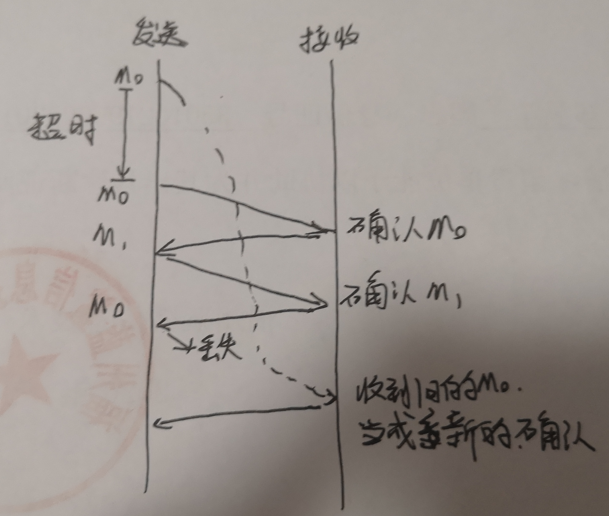

1. 微信、 QQ分别采用哪一种（或哪几种）运输层协议？为什么？新闻视频点播呢？

    - QQ: TCP、UDP
      - 在登录的时候通过TCP建立连接，防止丢包；
      - 建立连接后可以采用 TCP通知消息；
      - 语音和视频等流媒体可以采用 UDP
    - 微信主要使用 TCP 连接；
    - 新闻视频点播主要采用 UDP，丢包的影响较少，又对播放速率有要求；

2. 习题5-05、 08、 14、 15、 18、 22、 31
   
    - 5-05

        VOIP：比如新闻视频点播之类的。

    - 5-08

        发送方 UDP 对应用程序交下来的报文，在添加首部后就向下交付 IP 层。UDP 对应用层交下来的报文，既不合并，也不拆分，而是保留这些报文的边界。接收方 UDP 对 IP 层交上来的 UDP 用户数据报，在去除首部后就原封不动地交付上层的应用进程，一次交付一个完整的报文。

        发送方TCP对应用程序交下来的报文数据块，视为无结构的字节流（无边界约束，课分拆/合并），但维持各字节的顺序。

    - 5-14

        - 源端口1586
        - 目的端口69
        - 用户数据报总长度28字节
        - 数据部分长度20字节
        - 从客户发给服务器，服务器程序是TFFTP。

    - 5-15

        如果语音数据不是实时播放（边接受边播放）就可以使用TCP，因为TCP传输可靠；TCP的问题是开销大很多，可能会导致网速跟不上无法实时。UDP不保证可靠交付，传送文件时可能丢包。

    - 5-18

        

    - 5-22

        - L_max的最大值是2^32=4GB,G=2^30.
        - 满载分片数Q=2941758
        - 发送的总报文数N=4489122708+682=4489123390
        - 总字节数是N=4489123390字节，发送4489123390字节需时间为3591.3秒，即59.85分

    - 5-31

        - L=65536×8+40×8=524600
        - C=109b/s
        - L/C=0.0005246s
        - Throughput=L/(L/C+2×Td)=524600/0.0205246=25.5Mb/s
        - Efficiency=(L/C)//(L/C+2×D)=0.0255